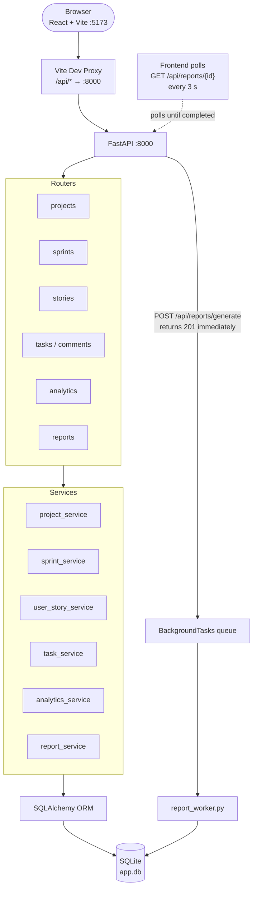
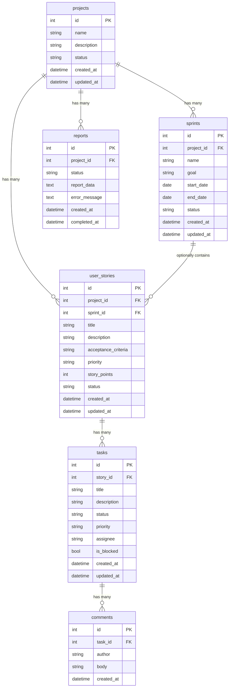

# Agile Project Management Tool

📹 **[Watch the walkthrough video](YOUR_GOOGLE_DRIVE_LINK_HERE)**

A lightweight, full-stack Agile project management platform built for small software teams. The application provides clean project management through the **Project → User Story → Task** hierarchy, a Kanban board, sprint management, backlog, analytics, and asynchronous report generation.

---

## Project Overview

This application enables a small software team to plan, track, and complete Agile work. Users can create projects, organize them into user stories, break stories into tasks, plan and run sprints, view analytics, and generate background progress reports - all through a minimal, professional interface.

---

## Features

- **Project Management** - Create, view, edit, and delete projects with live progress metrics
- **User Story Management** - Full CRUD with story points (Fibonacci: 1, 2, 3, 5, 8), priority, status, acceptance criteria
- **Task Management** - Create tasks under stories; set status, priority, assignee, blocked state
- **Kanban Board** - Drag-and-drop board: To Do, In Progress, In Review, Done
- **Backlog** - Dedicated backlog view; assign stories to sprints
- **Sprint Management** - Create sprints with date ranges; track story points and progress
- **Task Detail Modal** - Full task detail with inline editing and comment thread
- **Comments** - Add timestamped comments to tasks
- **Dashboard** - Project overview with task counts, completion percentage, active sprint summary
- **Analytics** - Burndown chart and velocity chart from real data
- **Async Report Generation** - Background report with polling, failure handling, and retry
- **Seed Data** - Demo project for immediate demonstration
- **OpenAPI Documentation** - Swagger UI at `/api/docs`

---

## Tech Stack

### Frontend
| Technology | Purpose |
|---|---|
| React 18 | Component-based UI and state |
| Vite | Fast development server and build |
| Tailwind CSS | Utility-first styling with custom design tokens |
| React Router v6 | Client-side routing |
| Axios | HTTP client with interceptors |
| Recharts | Burndown and velocity chart visualisations |
| @hello-pangea/dnd | Drag-and-drop Kanban board |

### Backend
| Technology | Purpose |
|---|---|
| Python 3.10+ | Application language |
| FastAPI | REST API framework with automatic OpenAPI docs |
| Pydantic v2 | Request/response validation |
| SQLAlchemy 2.x | ORM for database interaction |
| SQLite | Embedded relational database |
| uvicorn | ASGI server |

---

## Architecture



---

## Setup Instructions

### Requirements
- Python 3.10 or higher
- Node.js 18 or higher

### Backend Setup

```bash
cd backend

# Create virtual environment
python -m venv venv
venv\Scripts\activate          # Windows
# source venv/bin/activate     # macOS/Linux

# Install dependencies
pip install -r requirements.txt

# Copy environment file
copy .env.example .env

# (Optional) Seed demo data
python seed.py

# Start backend server
uvicorn app.main:app --reload --port 8000
```

### Frontend Setup

```bash
cd frontend

npm install
copy .env.example .env
npm run dev
```

Open http://localhost:5173

### Environment Variables

**backend/.env**
```
DATABASE_URL=sqlite:///./app.db
CORS_ORIGINS=["http://localhost:5173","http://localhost:3000"]
APP_ENV=development
```

**frontend/.env**
```
VITE_API_BASE_URL=http://localhost:8000
```

---

## API Documentation

| URL | Description |
|---|---|
| http://localhost:8000/api/docs | Swagger UI (interactive) |
| http://localhost:8000/api/redoc | ReDoc |

### Endpoints

| Resource | Routes |
|---|---|
| Projects | GET/POST /api/projects, GET/PUT/DELETE /api/projects/{id} |
| Sprints | GET/POST /api/sprints, GET/PUT /api/sprints/{id}, POST /api/sprints/{id}/stories |
| Stories | GET/POST /api/stories, GET/PUT/DELETE /api/stories/{id} |
| Tasks | GET/POST /api/tasks, GET/PUT/DELETE /api/tasks/{id}, PATCH /api/tasks/{id}/status, PATCH /api/tasks/{id}/toggle-block |
| Comments | GET/POST /api/tasks/{task_id}/comments |
| Analytics | GET /api/analytics/project/{id}/stats, GET /api/analytics/sprint/{id}/burndown, GET /api/analytics/project/{id}/velocity |
| Reports | POST /api/reports/generate, GET /api/reports/{id}, GET /api/reports/project/{id}, POST /api/reports/{id}/retry |

---

## Database Schema



**Notes:**
- `sprint_id` on `user_stories` is nullable - stories start in the backlog with no sprint
- `completed_at` on `reports` is nullable - set only when status reaches `completed`
- All cascade deletes follow the relationship arrows (delete a project → deletes its sprints, stories, tasks, comments, and reports)

---

## Design Decisions

- **SQLite**: Zero infrastructure overhead; sufficient for small team per assignment spec
- **FastAPI BackgroundTasks**: Built-in, no Redis/Celery needed; I/O-bound report generation fits this model
- **No Redux**: Custom hooks + useState is sufficient; Redux would be premature complexity
- **@hello-pangea/dnd**: Maintained fork of react-beautiful-dnd; React 18 compatible
- **Story-level burndown**: Sprint planning at story level matches real Agile practice; tasks are implementation detail
- **Free-text assignee**: No auth in scope; keeps focus on project management

---

## Tradeoffs

| Decision | Tradeoff |
|---|---|
| SQLite | No concurrent writes; swap PostgreSQL for production |
| BackgroundTasks | Pending reports lost on server restart; acceptable for demo |
| No authentication | Any user can edit any item; intentional per scope |
| Client polling | 3-second polling vs WebSocket; simpler and sufficient |
| Story-level burndown | Less granular than per-task; more stable for demonstration |

---

## Security Considerations

- All request bodies validated by Pydantic (422 on invalid input)
- SQLAlchemy ORM used throughout - no raw SQL
- CORS configured explicitly from environment variable (not wildcard)
- Configuration loaded from .env (excluded from git)
- All service functions validate entity existence before operations
- Status values validated against enums at schema level
- Story points validated against [1,2,3,5,8] in Pydantic validators
- Internal error tracebacks stored in DB, not exposed to API clients

---

## Testing

The test suite uses **pytest** with a file-based SQLite test database (`test_run.db`) that is created before each test and deleted after - it never touches `app.db`.

```bash
cd backend
venv\Scripts\activate        # Windows
# source venv/bin/activate   # macOS/Linux

# Run all unit tests (fast, ~3 seconds)
pytest tests/ -v -m "not integration"

# Run everything including background-worker integration tests
pytest tests/ -v
```

| File | What it covers |
|---|---|
| `tests/test_hierarchy.py` | Full Project → Story → Task creation, update, delete, cascade |
| `tests/test_validation.py` | Enum rejection (422), Fibonacci story points, 422 error shape |
| `tests/test_404.py` | Non-existent resource returns 404 with detail message |
| `tests/test_reports.py` | Report generate/retrieve/list/404; background worker marked `@integration` |
| `tests/test_comments.py` | Comment create, list, chronological order |

> **Note on `@integration` tests:** The two `test_report_completes` and `test_completed_report_has_data` tests exercise the full async lifecycle. They are marked `@pytest.mark.integration` and skipped by default (`-m "not integration"`) because FastAPI's `BackgroundTasks` open their own `SessionLocal` which bypasses the test-DB dependency override - these tests pass when run against the real server.

---

## Async Workflow

### Report Generation

1. Frontend: `POST /api/reports/generate` with `{project_id}`
2. Backend: Creates Report row (`status=pending`), returns it instantly
3. FastAPI queues `generate_report()` as BackgroundTask (own DB session via SessionLocal)
4. Worker: `pending → processing → completed` (or `failed` on error)
5. Frontend: polls `GET /api/reports/{id}` every 3 seconds
6. On completion: report JSON displayed in UI

### Failure Handling

- Exception in worker → `status=failed`, Python traceback in `error_message`
- Frontend shows "Retry" button on failure
- `POST /api/reports/{id}/retry` → resets to `pending`, re-queues task

---

## AI Usage

I researched the requirements and worked out the core design myself - the Project → User Story → Task hierarchy, the database relationships, and the choice of FastAPI BackgroundTasks (over Celery/Redis) for the async report workflow. I used AI tools (Claude/Antigravity) to help scaffold boilerplate faster - repetitive CRUD routers/services on the backend, and component structure on the frontend - based on the structure and design system I specified. I then went through the generated code manually and tested each endpoint myself, which caught a real gap: `status`/`priority` fields weren't actually validated against the enums I'd defined in `constants.py`, even though I'd planned for that - the schemas were typed as plain `str`. I fixed it by wiring the existing enum classes into the Pydantic schemas, and added automated tests (`tests/test_validation.py`) to confirm invalid values are now rejected with a 422.

The application logic itself is deterministic CRUD, status transitions, date arithmetic, and aggregation - no AI/ML functionality in the app itself.

---

## Future Improvements

1. User authentication (JWT + role-based access)
2. Real-time updates via WebSocket
3. File attachments on tasks
4. Per-task granularity burndown
5. Sprint retrospective notes
6. PDF/CSV report export
7. PostgreSQL support for production
8. Dark mode
9. Epic tier above User Stories
10. Time tracking on tasks
